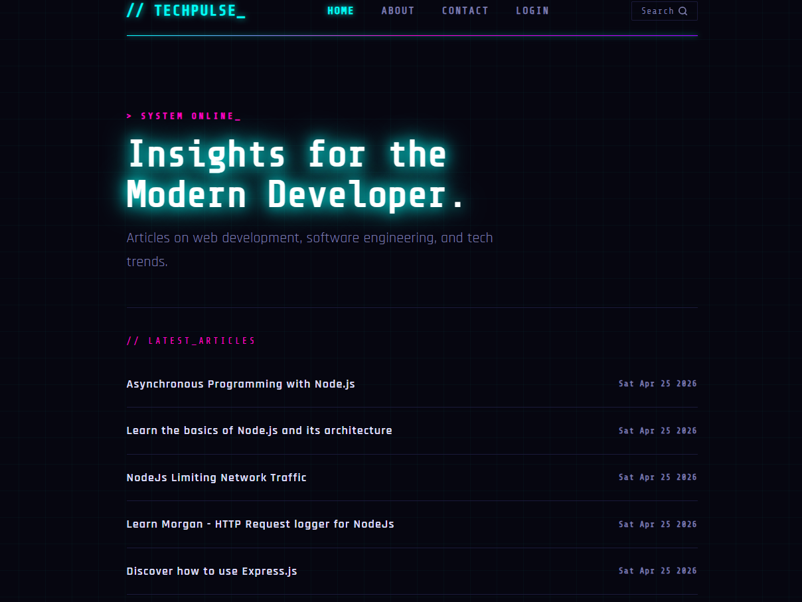
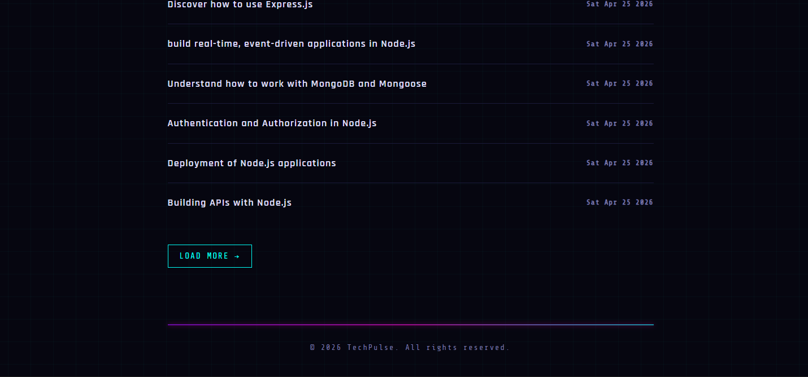
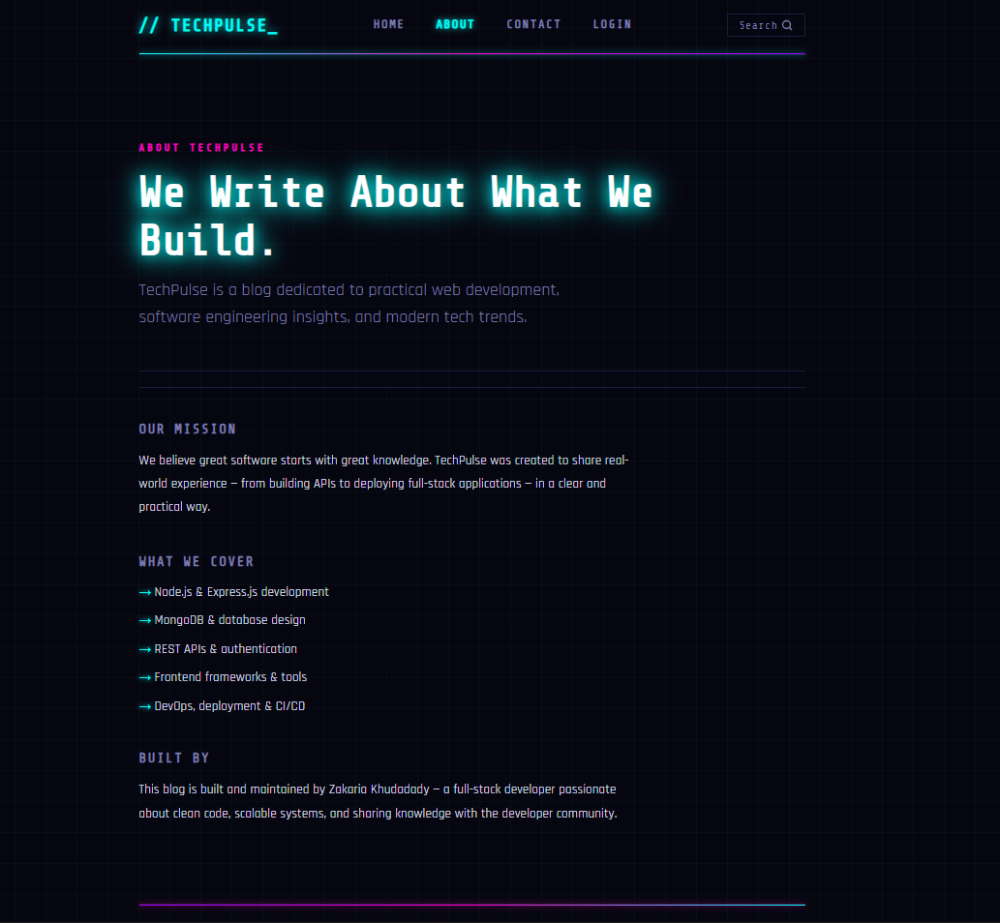
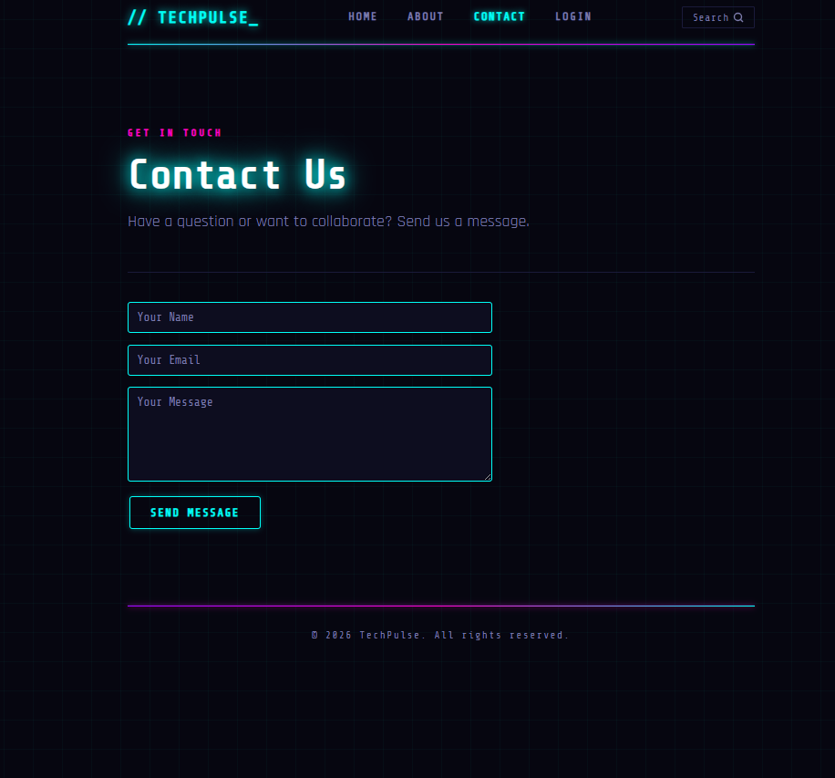
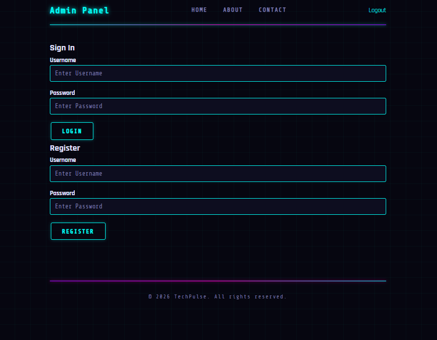
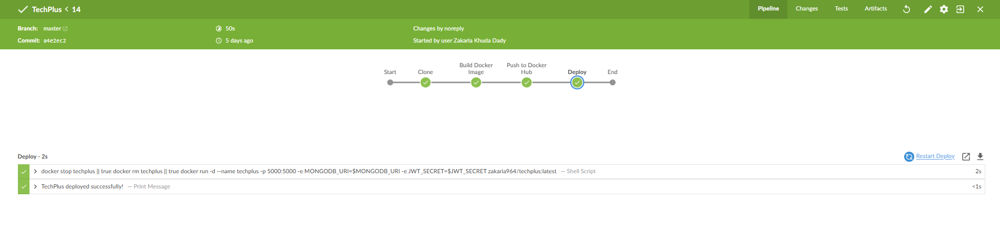
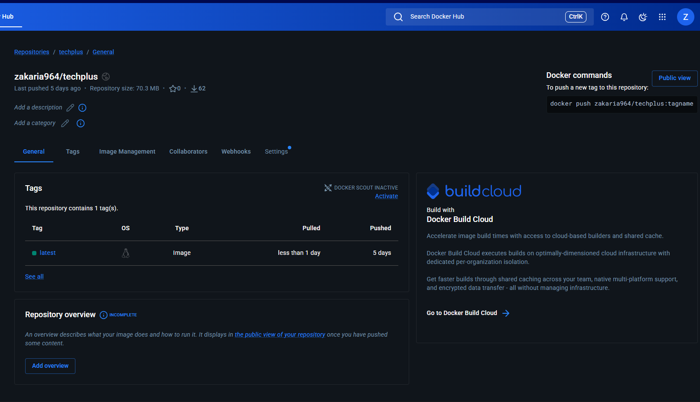

# TechPulse — Developer Knowledge Hub


A full-stack developer knowledge hub featuring curated tech articles, an admin panel, and a clean cyberpunk-inspired UI — deployed with a full CI/CD pipeline on AWS.

## Live Demo

**[https://techplus.zak-dev.com](https://techplus.zak-dev.com)**

---

## Preview

### Home Page
The landing page displays the latest developer articles with titles and publish dates. Articles are loaded dynamically from MongoDB.



---

### Article Feed
Articles are listed with a **Load More** button for pagination, keeping the page clean and fast without loading everything at once.



---

### About Page
Describes the mission of TechPulse and the topics covered — Node.js, MongoDB, REST APIs, frontend frameworks, and DevOps/CI-CD.



---

### Contact Page
A contact form allowing visitors to send messages directly from the site.



---

### Admin Panel
A secure admin panel protected by JWT authentication. Admins can sign in to manage articles — create, edit, and delete posts.



---

## Features

- Browse and read developer articles
- Search articles by keyword
- Load more articles with pagination
- Admin panel with secure login and registration
- Create, edit, and delete articles (admin only)
- Contact form
- JWT authentication with Bcrypt password hashing
- MongoDB session persistence

---

## Tech Stack

| Layer | Technology |
|---|---|
| Runtime | Node.js |
| Framework | Express.js |
| Templating | EJS + Express EJS Layouts |
| Database | MongoDB + Mongoose |
| Authentication | JWT + Bcrypt |
| Session Storage | connect-mongo |
| Styling | Custom CSS |
| Containerization | Docker |
| CI/CD | Jenkins |
| Web Server | Nginx (reverse proxy + SSL) |
| Hosting | AWS EC2 |
| DNS | AWS Route 53 |
| SSL | Let's Encrypt (Certbot) |

---

## Architecture

```
Git Push → Jenkins Pipeline → Docker Build & Push
                                        ↓
                              Docker Hub Registry
                                        ↓
                           AWS EC2 (Docker Pull + Run)
                                        ↓
                       Nginx Reverse Proxy + SSL (Let's Encrypt)
                                        ↓
                          https://techplus.zak-dev.com
```

---

## CI/CD Pipeline

Every push to `main` triggers an automated pipeline:

1. Jenkins detects the push via GitHub webhook
2. Pulls latest code and builds a Docker image
3. Pushes image to Docker Hub (`zakaria964/techplus`)
4. SSHs into AWS EC2 and pulls the latest image
5. Restarts the container automatically




---

## Getting Started

### Prerequisites

- Node.js v18+
- MongoDB (local or MongoDB Atlas)

### Installation

```bash
git clone https://github.com/Zakaria-Khuda-Dady/TechPlus.git
cd TechPlus
npm install
```

Create a `.env` file in the root:

```env
MONGODB_URI=your_mongodb_connection_string
JWT_SECRET=your_jwt_secret
PORT=5000
```

```bash
npm run dev
```

Visit `http://localhost:5000`

---

## Docker

```bash
docker pull zakaria964/techplus:latest
docker run -p 5000:5000 \
  -e MONGODB_URI=your_mongodb_uri \
  -e JWT_SECRET=your_jwt_secret \
  zakaria964/techplus
```

---

## Environment Variables

| Variable | Description |
|---|---|
| `MONGODB_URI` | MongoDB connection string |
| `JWT_SECRET` | Secret key for JWT signing |
| `PORT` | App port (default 5000) |

---

## Project Structure

```
TechPlus/
├── server/
│   ├── config/        # Database connection
│   ├── helpers/       # Utility functions
│   ├── models/        # Mongoose schemas
│   └── routes/        # Express routes (main + admin)
├── views/
│   ├── layouts/       # EJS layout templates
│   └── admin/         # Admin panel views
├── public/            # Static assets (CSS, JS, images)
├── screenshots/       # App preview images
├── Dockerfile
├── Jenkinsfile
├── app.js             # Entry point
└── .env               # Environment variables (not committed)
```

---

## Author

**Zakaria Khudadady** — Full Stack Developer

---

## License

MIT
